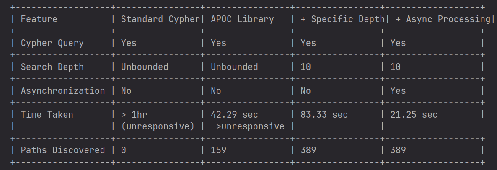

# Wikipedia Graph Database Project


## Introduction

This project provides a command-line interface to interact with a graph database representing Wikipedia's Main Topic Classification categories. It allows efficient querying and exploration of the category hierarchy.

[Link to Wikipedia classifications](https://en.wikipedia.org/wiki/Category:Main_topic_classifications)

## Table of Contents

1. [Technologies Used](#technologies-used)
2. [Architecture](#architecture)
3. [Prerequisites](#prerequisites)
4. [Installation](#installation)
5. [Setup](#setup)
6. [Design and Implementation](#design-and-implementation)
7. [Usage](#usage)
8. [Results](#results)
9. [Self-Evaluation](#self-evaluation)
10. [Contributing](#contributing)
11. [Support](#support)
12. [License](#license)

## Technologies Used

- Neo4j (version 5.20.0)
- Python (version 3.12.3)

## Architecture

### Components

- **Neo4j Database**: Stores the graph data representing Wikipedia classifications.
- **Python Scripts**:
  - `import_data.py`: Imports data from CSV files into Neo4j.
  - `utils.py`: Provides utility functions for database operations.
  - `goals.py`: Defines functions for various database queries.
  - `dbcli.py`: Command-line interface for interacting with the database.
- **Configuration**:
  - `config.py`: Stores database connection details and other settings.

### Data Flow

1. Data Import: `import_data.py` processes and imports data from `taxonomy_iw.csv.gz` into Neo4j.
2. Database Interaction: `dbcli.py` executes user commands using functions from `goals.py`.
3. Utility Functions: `utils.py` manages database connections and query execution.

## Prerequisites

- Python 3.12.3
- Neo4j server
- Virtual environment
- Required Python packages: neo4j, pandas, tqdm (optional)

## Installation

### Installing Neo4j (Ubuntu)

```bash
sudo apt update && sudo apt upgrade -y
wget -O - https://debian.neo4j.com/neotechnology.gpg.key | sudo apt-key add -
echo 'deb https://debian.neo4j.com stable 4.x' | sudo tee /etc/apt/sources.list.d/neo4j.list
sudo apt update
sudo apt install neo4j -y
```

Verify installation: `neo4j --version`

### Installing Python and Setting Up Environment

```bash
sudo apt install python3 python3-venv python3-pip -y
python3 -m venv myenv
source myenv/bin/activate
pip install neo4j pandas tqdm
```

## Setup

1. Download [taxonomy_iw.csv.gz](taxonomy_iw.csv.gz) to the project directory.
2. Download project files: [config.py](src/config.py), [utils.py](src/utils.py), [import_data.py](src/import_data.py), [goals.py](src/goals.py), [dbcli.py](src/dbcli.py).
3. Navigate to the project directory: `cd dbproject`
4. Activate the virtual environment: `source myenv/bin/activate`
5. Start Neo4j server:
   ```bash
   sudo systemctl enable neo4j
   sudo systemctl start neo4j
   ```
6. Set up Neo4j browser:
   - Open `http://localhost:7474` in your web browser.
   - Set a password for the default `neo4j` user.
7. Update `config.py` with your Neo4j credentials.
8. Import data: `python import_data.py`

## Design and Implementation

1. **Schema Design**:
   - Node

## Manual

To reproduce the results:

1. Follow the installation and setup instructions.
2. Use the CLI commands as described in the Usage section.
3. Compare your output with the examples in the Results folder.s: Categories with `name` property

   - Relationships: `HAS_SUBCATEGORY` between parent-child nodes
   - Unique constraint on `name` property
   - Index on `name` property for all nodes

4. **Data Import**:

   - Batch processing with multi-threading (4 cores)
   - Error handling and retries
   - Progress tracking with tqdm

5. **Query Functions**:

   - Implemented in `goals.py`
   - Use Cypher queries for efficient graph traversal
   - Yield results for streaming

6. **Command Line Interface**:
   - `dbcli.py` provides a user-friendly interface
   - Executes queries and streams results

## Usage

Activate the virtual environment and run:

```bash
python dbcli.py <goal_number> [arguments]
```

Available goals:

1. Find children of a node: `python dbcli.py 1 <node_name>`
2. Count children of a node: `python dbcli.py 2 <node_name>`
3. Find grandchildren of a node: `python dbcli.py 3 <node_name>`
4. Find parents of a node: `python dbcli.py 4 <node_name>`
5. Count parents of a node: `python dbcli.py 5 <node_name>`
6. Find grandparents of a node: `python dbcli.py 6 <node_name>`
7. Count unique nodes: `python dbcli.py 7`
8. Find root nodes: `python dbcli.py 8`
9. Find nodes with most children: `python dbcli.py 9`
10. Find nodes with least children: `python dbcli.py 10`
11. Rename a node: `python dbcli.py 11 <old_name> <new_name>`
12. Find paths between nodes: `python dbcli.py 12 <start_node> <end_node> [search_depth]`

## Results

Detailed query results can be found in the [Results](Results) folder.

## Self-Evaluation

### Optimization of Goal 12 (Find all paths between two given nodes)

Initial implementation faced performance issues with complex queries. Improvements made:

1. **Search Depth Limit**: Introduced a parameter to limit search depth, preventing exploration of irrelevant paths.
2. **Asynchronous Processing**: Implemented parallel path-finding from child nodes of the start node to the end node.

Performance comparison for the query from "Centuries" to "2020s_anime_films":



The optimized version with a default depth of 10 efficiently identifies relevant paths quickly, balancing depth and time efficiency. Custom depth can be set for more extensive searches when time is not a constraint.

## Contributing

Contributions to improve this project are welcome. Please submit pull requests or open issues in the project repository.

## Support

For assistance or inquiries, please open an issue in the project's issue tracker or contact [Pritam.Chakraborty1@outlook.com](mailto:Pritam.Chakraborty1@outlook.com).

## License

This project is licensed under the MIT License. See the [LICENSE](LICENSE) file for details.
